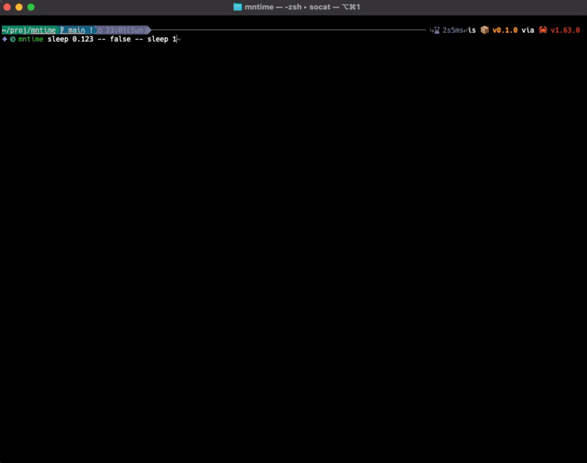

# mntime command

This `mntime` command internally uses [BSD Time `time -l`][time] or [GNU Time `gtime -v`][gtime] to calculate the mean.

[time]:https://www.freebsd.org/cgi/man.cgi?query=time
[gtime]:https://man7.org/linux/man-pages/man1/time.1.html

The `time -l` option and `gtime -v` option measure memory usage as well as execution time.
If you are only measuring execution time, you can use shell built-in `time` instead.

The project name comes from **m** commands and **n** times and also from **m**ea**n**. Besides, it is taken from **m**ultiple **n**umber **time**.

So, `mntime` executes the specified m commands n times and calculates the mean.

## Demo



## Key Features

- Measuring commands time and memory usage.
- Multiple runs to calculate mean, standard deviation, etc.

## Motivation

For project:

- Want to run multiple times and calculate the average.
- Want to measure the memory usage of the program.

<details><summary>For personal:</summary>

- Study the Rust language.
- Learn how to create TUI tool.
- Learn how to use git and GitHub

Yes, I am a new Rustacean, a professional programmer who usually uses C++, C# as language and Perforce for version control.
</details>

## Installation

### Rust Version

MSRV: `mntime` requires rustc 1.63.0 or newer.

### Dependent tools

[BSD Time][time] and [GNU Time][gtime]. For example, on Mac:

```sh
# BSD Time is default installed in /usr/bin/time
# GNU Time is installed as gtime with
brew install gnu-time
```

If neither of those is available, use bash built-in time, which only measures time and not memory-related data.

### mntime

```sh
cargo install mntime
```

Other convenient package is available yet.

## Usage

Please use the `-h`(shortly) or `--help`(fully) option for more information.

### Basic benchmarks

```sh
mntime sleep 1
```

result:

```txt
Benchmark #1> sleep '1'
            LEGEND            :         Mean ± σ (Coefficient of variation %) [Min ≦ Median ≦ Max] / Valid count
Elapsed (wall clock) time     :        1 sec ± 0 ns (0.0 %) [1 sec ≦ 1 sec ≦ 1 sec] / 10
User time                     :         0 ns ± 0 ns (0.0 %) [0 ns ≦ 0 ns ≦ 0 ns] / 10
System time                   :         0 ns ± 0 ns (0.0 %) [0 ns ≦ 0 ns ≦ 0 ns] / 10
Maximum resident set size     :    1.359 MiB ± 0 byte (0.0 %) [1.359 MiB ≦ 1.359 MiB ≦ 1.359 MiB] / 10
Reclaiming a frame page faults:          166 ± 0 (0.0 %) [166 ≦ 166 ≦ 166] / 10
Involuntary context switches  :          3.1 ± 0.3 (9.7 %) [3 ≦ 3 ≦ 4] / 10
     └─Excluding Outlier      :            3 ± 0 (0.0 %) [3 ≦ 3 ≦ 3] / 9(-1)
Page size                     :       16,384 ± 0 (0.0 %) [16,384 ≦ 16,384 ≦ 16,384] / 5
Instructions retired          :    3,106,667 ± 761.8 (0.0 %) [3,105,195 ≦ 3,107,013 ≦ 3,107,265] / 5
Cycles elapsed                :    1,108,346 ± 39,878 (3.6 %) [1,075,217 ≦ 1,081,719 ≦ 1,177,488] / 5
Peak memory footprint         :    903.1 KiB ± 7.869 KiB (0.9 %) [896.6 KiB ≦ 896.6 KiB ≦ 912.7 KiB] / 5
```

If the number of runs is not specified, it will run 10 times. If you want to change the number of runs, you can use the `-r`/`--runs` option.

```sh
mntime --runs 4 sleep 1
```

result:

```txt
Benchmark #1> sleep '1'
            LEGEND            :         Mean ± σ (Coefficient of variation %) [Min ≦ Median ≦ Max] / Valid count
Elapsed (wall clock) time     :        1 sec ± 0 ns (0.0 %) [1 sec ≦ 1 sec ≦ 1 sec] / 4
User time                     :         0 ns ± 0 ns (0.0 %) [0 ns ≦ 0 ns ≦ 0 ns] / 4
System time                   :         0 ns ± 0 ns (0.0 %) [0 ns ≦ 0 ns ≦ 0 ns] / 4
Maximum resident set size     :    1.359 MiB ± 0 byte (0.0 %) [1.359 MiB ≦ 1.359 MiB ≦ 1.359 MiB] / 4
Reclaiming a frame page faults:          166 ± 0 (0.0 %) [166 ≦ 166 ≦ 166] / 4
Involuntary context switches  :         3.25 ± 0.433 (13.3 %) [3 ≦ 3 ≦ 4] / 4
Page size                     :       16,384 ± 0 (0.0 %) [16,384 ≦ 16,384 ≦ 16,384] / 2
Instructions retired          :    3,101,767 ± 30.5 (0.0 %) [3,101,737 ≦ 3,101,798 ≦ 3,101,798] / 2
Cycles elapsed                :    1,127,008 ± 14,435 (1.3 %) [1,112,573 ≦ 1,141,444 ≦ 1,141,444] / 2
Peak memory footprint         :    896.6 KiB ± 0 byte (0.0 %) [896.6 KiB ≦ 896.6 KiB ≦ 896.6 KiB] / 2
```

### Compare benchmarks

When multiple commands are specified in this way, each is executed n times, the mean is calculated.

```sh
mntime sleep 1 -- sleep 0.9 -- sleep 1.1
```

OR

```sh
mntime 'sleep 1' 'sleep 0.9' 'sleep 1.1'
```

<details><summary>result expand here:</summary>

```txt
Benchmark #1> sleep '1'
            LEGEND            :         Mean ± σ (Coefficient of variation %) [Min ≦ Median ≦ Max] / Valid count
Elapsed (wall clock) time     :        1 sec ± 0 ns (0.0 %) [1 sec ≦ 1 sec ≦ 1 sec] / 10
User time                     :         0 ns ± 0 ns (0.0 %) [0 ns ≦ 0 ns ≦ 0 ns] / 10
System time                   :         0 ns ± 0 ns (0.0 %) [0 ns ≦ 0 ns ≦ 0 ns] / 10
Maximum resident set size     :    1.359 MiB ± 0 byte (0.0 %) [1.359 MiB ≦ 1.359 MiB ≦ 1.359 MiB] / 10
Reclaiming a frame page faults:        166.3 ± 0.9 (0.5 %) [166 ≦ 166 ≦ 169] / 10
     └─Excluding Outlier      :          166 ± 0 (0.0 %) [166 ≦ 166 ≦ 166] / 9(-1)
Involuntary context switches  :          3.4 ± 0.663 (19.5 %) [3 ≦ 3 ≦ 5] / 10
     └─Excluding Outlier      :        3.222 ± 0.416 (12.9 %) [3 ≦ 3 ≦ 4] / 9(-1)
Page size                     :       16,384 ± 0 (0.0 %) [16,384 ≦ 16,384 ≦ 16,384] / 5
Instructions retired          :    3,105,417 ± 2,386 (0.1 %) [3,102,700 ≦ 3,105,224 ≦ 3,109,298] / 5
Cycles elapsed                :    1,713,440 ± 362,263 (21.1 %) [1,204,750 ≦ 1,835,156 ≦ 2,095,253] / 5
Peak memory footprint         :    896.6 KiB ± 0 byte (0.0 %) [896.6 KiB ≦ 896.6 KiB ≦ 896.6 KiB] / 5
Benchmark #2> sleep '0.9'
            LEGEND            :         Mean ± σ (Coefficient of variation %) [Min ≦ Median ≦ Max] / Valid count
Elapsed (wall clock) time     :       900 ms ± 0 ns (0.0 %) [900 ms ≦ 900 ms ≦ 900 ms] / 10
User time                     :         0 ns ± 0 ns (0.0 %) [0 ns ≦ 0 ns ≦ 0 ns] / 10
System time                   :         0 ns ± 0 ns (0.0 %) [0 ns ≦ 0 ns ≦ 0 ns] / 10
Maximum resident set size     :    1.359 MiB ± 0 byte (0.0 %) [1.359 MiB ≦ 1.359 MiB ≦ 1.359 MiB] / 10
Reclaiming a frame page faults:        166.5 ± 1.025 (0.6 %) [166 ≦ 166 ≦ 169] / 10
     └─Excluding Outlier      :        166.2 ± 0.629 (0.4 %) [166 ≦ 166 ≦ 168] / 9(-1)
Involuntary context switches  :          3.8 ± 0.98 (25.8 %) [3 ≦ 4 ≦ 6] / 10
Page size                     :       16,384 ± 0 (0.0 %) [16,384 ≦ 16,384 ≦ 16,384] / 5
Instructions retired          :    3,104,586 ± 3,725 (0.1 %) [3,099,381 ≦ 3,104,934 ≦ 3,110,136] / 5
Cycles elapsed                :    2,058,486 ± 88,114 (4.3 %) [1,960,047 ≦ 2,059,735 ≦ 2,191,571] / 5
Peak memory footprint         :    896.6 KiB ± 0 byte (0.0 %) [896.6 KiB ≦ 896.6 KiB ≦ 896.6 KiB] / 5
Benchmark #3> sleep '1.1'
            LEGEND            :         Mean ± σ (Coefficient of variation %) [Min ≦ Median ≦ Max] / Valid count
Elapsed (wall clock) time     :      1.1 sec ± 0 ns (0.0 %) [1.1 sec ≦ 1.1 sec ≦ 1.1 sec] / 10
User time                     :         0 ns ± 0 ns (0.0 %) [0 ns ≦ 0 ns ≦ 0 ns] / 10
System time                   :         0 ns ± 0 ns (0.0 %) [0 ns ≦ 0 ns ≦ 0 ns] / 10
Maximum resident set size     :    1.367 MiB ± 24 KiB (1.7 %) [1.359 MiB ≦ 1.359 MiB ≦ 1.438 MiB] / 10
     └─Excluding Outlier      :    1.359 MiB ± 0 byte (0.0 %) [1.359 MiB ≦ 1.359 MiB ≦ 1.359 MiB] / 9(-1)
Reclaiming a frame page faults:        166.7 ± 1.792 (1.1 %) [166 ≦ 166 ≦ 172] / 10
     └─Excluding Outlier      :        166.1 ± 0.314 (0.2 %) [166 ≦ 166 ≦ 167] / 9(-1)
Involuntary context switches  :          5.2 ± 2.993 (57.6 %) [3 ≦ 3 ≦ 10] / 10
Page size                     :       16,384 ± 0 (0.0 %) [16,384 ≦ 16,384 ≦ 16,384] / 5
Instructions retired          :    3,122,063 ± 37,238 (1.2 %) [3,098,763 ≦ 3,105,055 ≦ 3,196,271] / 5
Cycles elapsed                :    1,795,267 ± 455,814 (25.4 %) [1,182,997 ≦ 2,098,421 ≦ 2,283,568] / 5
Peak memory footprint         :    912.6 KiB ± 32 KiB (3.5 %) [896.6 KiB ≦ 896.6 KiB ≦ 976.6 KiB] / 5
     └─Excluding Outlier      :    896.6 KiB ± 0 byte (0.0 %) [896.6 KiB ≦ 896.6 KiB ≦ 896.6 KiB] / 4(-1)
```

</details>

#### Note

If only a command with no arguments is specified, the 'command' enclosure cannot be specified. "--" delimiters should be used. It is possible to mix both. For example,

```sh
# All the same
mntime 'command1 --flag arg' command2 -- 'command3 -f -- args'
mntime 'command1' --flag arg -- command2 -- 'command3 -f -- args'
## Following is recommended
mntime command1 --flag arg -- command2 -- 'command3 -f -- args'
```

"--" delimiters are recommended, except when they contain " -- ".

## Roadmap

- [ ] Output in csv and json for integration with other tools.
- [ ] Displays the advantage between each command when measuring multiple commands.
- [ ] Visualization of results.

See the open issues for a full list of proposed features (and known issues).

## Alternative tools

`mntime` is inspired by [hyperfine](https://github.com/sharkdp/hyperfine).

## Dependencies

Direct dependencies crates:

```sh
cargo license --direct-deps-only --avoid-build-deps --avoid-dev-deps | awk -F ":" 'BEGIN {printf "|License|crate|\n|-|-|\n"} {printf "|%s|%s|\n", $1, $2}'
```

|License|crate|
|-|-|
|Apache-2.0 OR MIT (7)| anyhow, clap, num-format, once_cell, proc-exit, regex, thiserror|
|MIT (4)| atty, crossterm, strum, tui|
|Zlib (2)| mntime, throbber-widgets-tui|

Chain dependencies crates:

```sh
cargo license --avoid-build-deps --avoid-dev-deps | awk -F ":" 'BEGIN {printf "|License|crate|\n|-|-|\n"} {printf "|%s|%s|\n", $1, $2}'
```

|License|crate|
|-|-|
|(MIT OR Apache-2.0) AND Unicode-DFS-2016 (1)| unicode-ident|
|Apache-2.0 OR Apache-2.0 WITH LLVM-exception OR MIT (1)| wasi|
|Apache-2.0 OR MIT (55)| anyhow, arrayvec, bitflags, cassowary, cfg-if, clap, clap_derive, clap_lex, getrandom, hashbrown, heck, hermit-abi, indexmap, itoa, libc, lock_api, log, num-format, once_cell, os_str_bytes, parking_lot, parking_lot_core, ppv-lite86, proc-exit, proc-macro-error, proc-macro-error-attr, proc-macro2, quote, rand, rand_chacha, rand_core, regex, regex-syntax, rustversion, scopeguard, signal-hook, signal-hook-mio, signal-hook-registry, smallvec, syn, thiserror, thiserror-impl, unicode-segmentation, unicode-width, winapi, winapi-i686-pc-windows-gnu, winapi-x86_64-pc-windows-gnu, windows-sys, windows_aarch64_gnullvm, windows_aarch64_msvc, windows_i686_gnu, windows_i686_msvc, windows_x86_64_gnu, windows_x86_64_gnullvm, windows_x86_64_msvc|
|MIT (10)| atty, crossterm, crossterm_winapi, mio, redox_syscall, strsim, strum, strum_macros, textwrap, tui|
|MIT OR Unlicense (4)| aho-corasick, memchr, termcolor, winapi-util|
|Zlib (2)| mntime, throbber-widgets-tui|

## License

"mntime" is under [zlib License](./LICENSE). Please feel free to use this, but no warranty.
