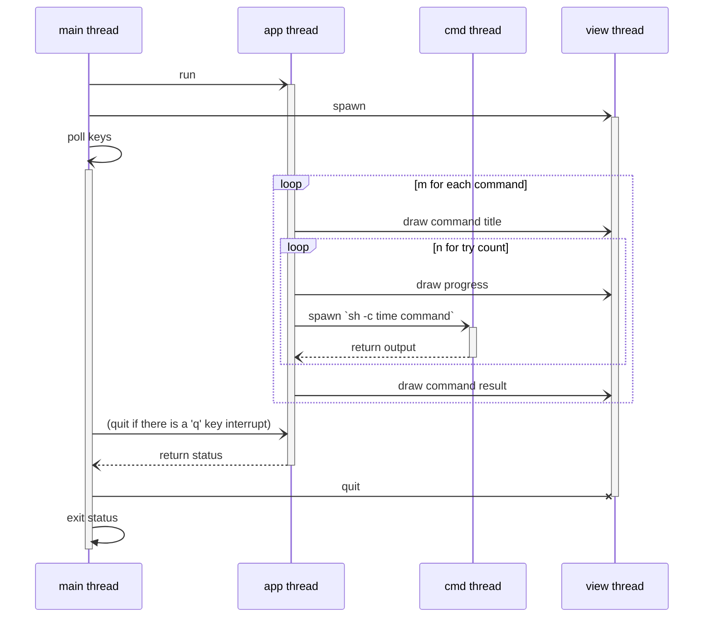

# Design of mntime

## Sequence Diagram

```mermaid
sequenceDiagram
participant main as main thread
participant app as app thread
participant cmd as cmd thread
participant view as view thread

main-)+app: run
main-)+view: spawn
main-)+main: poll keys
    loop m for each command
    app-)view: draw command title
    loop n for try count
    app-)view: draw progress
    app-)+cmd: spawn `sh -c time command`
        cmd--)-app: return output
    end
    app-)view: draw command result
    end
main-)app: (quit if there is a 'q' key interrupt)
    app--)-main: return status
main -x view: quit
deactivate view
main->>-main: exit status
```
